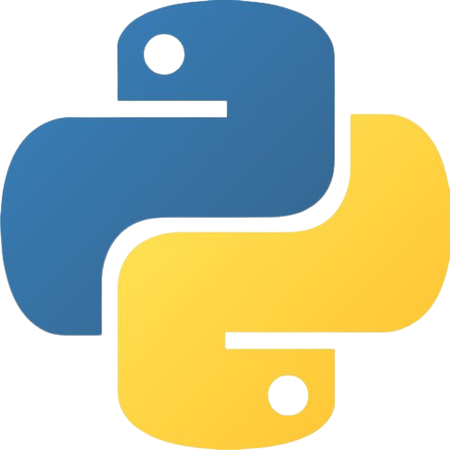

# 👋 Hello World

- ✨ Olá, me chamo Maria, é um prazer te conhecer.
- 🏛️ Estudo Sistemas de Informação no Instituto Federal Catarinense.
- 🌱 Atualmente estou aprendendo mais sobre desenvolvimento back-end com django.

  
  
  
  
<!--    -->

### 📫 Você pode me encontrar por aqui

  
  
   

